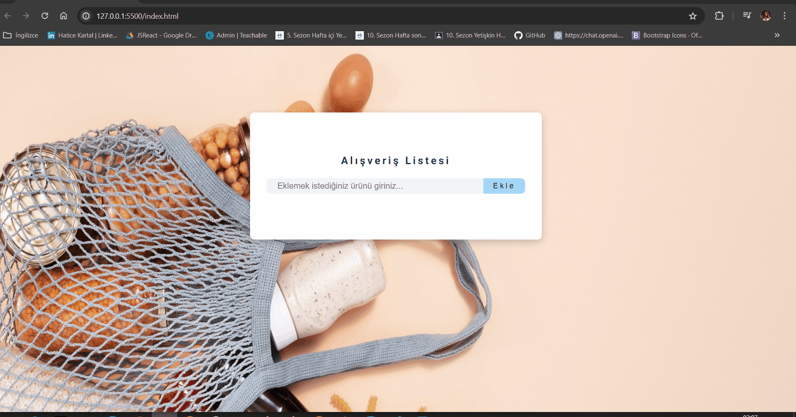

# Crud App 
Bu depo, temel CRUD (Create, Read, Update, Delete) işlemlerini gerçekleştirmek için bir web uygulamasını içerir. CRUD, veritabanı işlemlerini ifade eder ve genellikle bir uygulamanın ana fonksiyonları arasında yer alır.

# Özellikler 
- **Oluşturma (Create):** Kullanıcıların yeni bir öğe eklemesine olanak tanır. Örneğin, yeni bir müşteri, görev veya not ekleyebilirler.
- **Okuma (Read):** Kullanıcıların mevcut verileri görüntülemesine olanak tanır. Örneğin, tüm müşterileri, görevleri veya notları listeleyebilirler.
- **Güncelleme (Update):** Kullanıcıların mevcut verileri güncellemesine olanak tanır. Örneğin, bir müşteri bilgisini, görev durumunu veya not içeriğini güncelleyebilirler.
- **Silme (Delete):** Kullanıcıların mevcut verileri silmesine olanak tanır. Örneğin, bir müşteri, görev veya notu sistemden kaldırabilirler.

# Kullanılan Teknolojiler
- HTML
- css
- JavaScript

# GIF

